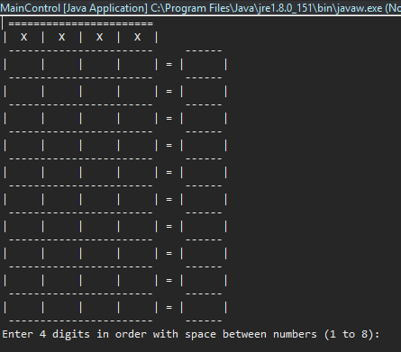
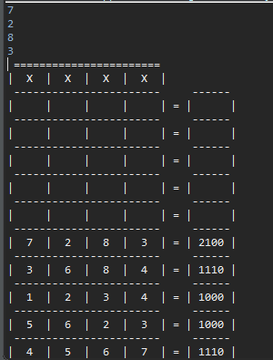
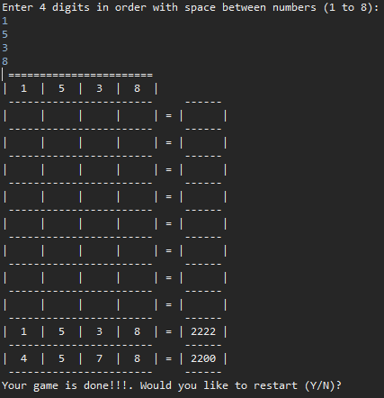
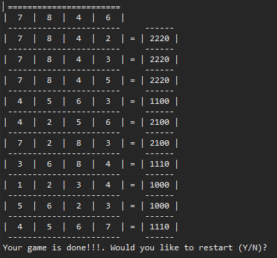

# Mastermind
##### - A simple Mastermind game based Java
##### - Immplementing Interface and multidimensional arrays

##### - On the right side, shows the scrore fo the each number the user types.

##### - Show the randomly generated answer at the top of the table once the user put the correct 4 ditgit numbers in a row.

##### - Show the randomly generated answer at the top of the table if the user faies to put the correct 4 digit numbers.

